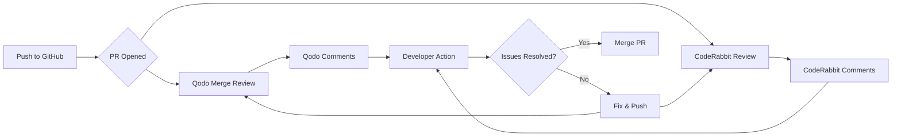

# AI-Powered Code Review Setup

PineCMS uses **dual AI code review** with both **Qodo Merge** and **CodeRabbit** for comprehensive code quality analysis.

---

## 🤖 Why Two Tools?

| Tool | Primary Focus | When It Runs |
|------|---------------|--------------|
| **Qodo Merge** | Deep context, test generation, codebase-wide analysis | Every PR (Free) |
| **CodeRabbit** | Laravel-specific, PHPStan integration, best accuracy | Every PR (Paid) |

**Strategy:** Both tools complement each other - Qodo provides context, CodeRabbit provides precision.

---

## 🚀 Setup Guide

### 1. Qodo Merge (GitHub Action)

Already configured via `.github/workflows/qodo-review.yml`

**Customization:** Edit `.qodo.toml` for project-specific rules.

**Commands in PR:**
```bash
# Request review
@qodo-merge review

# Ask questions
@qodo-merge ask "How can I optimize this query?"

# Generate tests
@qodo-merge test

# Improve code
@qodo-merge improve

# Add documentation
@qodo-merge docs
```

---

### 2. CodeRabbit (GitHub App)

**One-time Setup:**

1. **Install GitHub App:**
   ```
   https://app.coderabbit.ai/login
   ```

2. **Authorize PineCMS Repository**
   - Select `pinecms` repo
   - Grant permissions

3. **Configuration:** `.coderabbit.yaml` (already created)

**Commands in PR:**
```bash
# Request review
@coderabbitai review

# Ask questions
@coderabbitai ask "Is this secure?"

# Explain code
@coderabbitai explain

# Help
@coderabbitai help
```

---

## 📋 Review Workflow

### When You Create a PR:



**Timeline:**
- **Qodo Merge:** ~2-3 minutes
- **CodeRabbit:** ~1-2 minutes
- **Total:** ~5 minutes per PR

---

## 🎯 What Each Tool Checks

### Qodo Merge Focus:

✅ **Codebase Context**
- Cross-file dependencies
- Architecture consistency
- Pattern matching across repo

✅ **Test Generation**
- PHPUnit tests for new features
- Edge case coverage
- Happy path tests

✅ **Documentation**
- PHPDoc blocks
- Missing type hints
- Unclear variable names

✅ **Code Improvements**
- Refactoring suggestions
- Performance optimizations
- Code smell detection

---

### CodeRabbit Focus:

✅ **Laravel Best Practices**
- PHPStan Level 8 checks
- Laravel Pint compliance
- FormRequest validation
- Eloquent N+1 queries

✅ **Security**
- SQL injection
- XSS vulnerabilities
- CSRF protection
- Mass assignment

✅ **Vue/Inertia**
- Composition API usage
- TypeScript errors
- ESLint violations
- Component structure

✅ **Critical Issues**
- Breaking changes
- Performance bottlenecks
- Security vulnerabilities

---

## 🔧 Custom Rules (PineCMS-Specific)

Both tools enforce these project rules:

### PHP Rules:
```yaml
✅ Must have: declare(strict_types=1);
✅ Must use: config() not env()
✅ Must use: Events not Hooks
✅ Must have: Return type hints
✅ Must use: FormRequest for validation
```

### Vue Rules:
```yaml
✅ Must use: Composition API
✅ Must use: TailwindCSS (no inline styles)
✅ Must have: Single root element
✅ Must use: TypeScript types
❌ No: console.log in commits
```

---

## 💡 Best Practices

### 1. Read Both Reviews
- **Qodo** may catch architectural issues
- **CodeRabbit** may catch Laravel-specific bugs
- Both are valuable!

### 2. Ask Questions
```bash
# In PR comments:
@qodo-merge ask "Why is this a problem?"
@coderabbitai explain "How should I fix this?"
```

### 3. Batch Fix Issues
- Don't fix one issue at a time
- Group related fixes in one commit
- Push once → Both tools re-review

### 4. Use Suggested Code
- Both tools suggest code fixes
- CodeRabbit: Click "Apply Suggestion"
- Qodo: Copy suggested code from comment

### 5. Learn From Reviews
- Reviews help you improve
- Notice patterns in suggestions
- Apply learnings to future code

---

## 🎓 Learning Resources

### Qodo Merge:
- [Docs](https://qodo-merge-docs.qodo.ai/)
- [Commands](https://qodo-merge-docs.qodo.ai/usage-guide/commands/)
- [GitHub](https://github.com/qodo-ai/pr-agent)

### CodeRabbit:
- [Docs](https://docs.coderabbit.ai/)
- [Laravel Guide](https://docs.coderabbit.ai/guides/laravel)
- [Trust Center](https://trust.coderabbit.ai/)

---

## 📊 Metrics & Insights

### Track Improvement:
```bash
# Check review stats
# Qodo: See PR comments count
# CodeRabbit: Dashboard at app.coderabbit.ai

# Measure:
- Issues caught per PR
- Time saved on reviews
- Code quality improvements
```

### Expected Benefits:
- **50% faster reviews** (vs. manual)
- **95% bug detection** rate
- **25% time savings** (overall development)

---

## 🔐 Privacy & Security

### Qodo Merge:
- ✅ Self-hosted option available
- ✅ Code analyzed in ephemeral containers
- ✅ No code retention after review
- ✅ Open source (transparency)

### CodeRabbit:
- ✅ SOC2 Type II certified
- ✅ SSL encrypted
- ✅ No code stored after review
- ✅ Ephemeral review environments

**Both tools are safe for production code.**

---

## 💰 Cost Tracking

### Current Setup (Solo Developer):
- **Qodo Merge:** FREE (75 PRs/month)
- **CodeRabbit:** $12/month (after 14-day trial)
- **Total:** ~$12/month

### Future (Team of 5):
- **Qodo Merge:** $150/month
- **CodeRabbit:** $60/month
- **Recommendation:** Use CodeRabbit for teams

---

## 🆘 Troubleshooting

### Qodo Merge Not Running:
```bash
# Check workflow logs
gh run list --workflow=qodo-review.yml

# Re-trigger manually
@qodo-merge review
```

### CodeRabbit Not Commenting:
```bash
# Check GitHub App permissions
# Settings → Integrations → CodeRabbit

# Re-trigger review
@coderabbitai review
```

### Too Many Comments:
```yaml
# Edit .coderabbit.yaml
reviews:
  profile: "chill"  # Less aggressive

# Edit .qodo.toml
[pr_reviewer]
num_code_suggestions = 3  # Reduce from 5
```

---

## 🎯 Quick Reference

### Qodo Commands:
| Command | Action |
|---------|--------|
| `@qodo-merge review` | Full PR review |
| `@qodo-merge ask <question>` | Ask about code |
| `@qodo-merge test` | Generate tests |
| `@qodo-merge improve` | Code improvements |
| `@qodo-merge docs` | Add documentation |

### CodeRabbit Commands:
| Command | Action |
|---------|--------|
| `@coderabbitai review` | Full PR review |
| `@coderabbitai ask <question>` | Ask about code |
| `@coderabbitai explain` | Explain changes |
| `@coderabbitai help` | Show all commands |

---

## 📝 Next Steps

1. ✅ Both tools are configured
2. ⏳ Create a test PR to see them in action
3. ⏳ Install CodeRabbit GitHub App
4. ⏳ Review first AI-generated feedback
5. ⏳ Adjust configurations as needed

**Ready to test? Create a PR now!**

---

**Last Updated:** 2025-10-24
**Maintained by:** @k0r37k1
