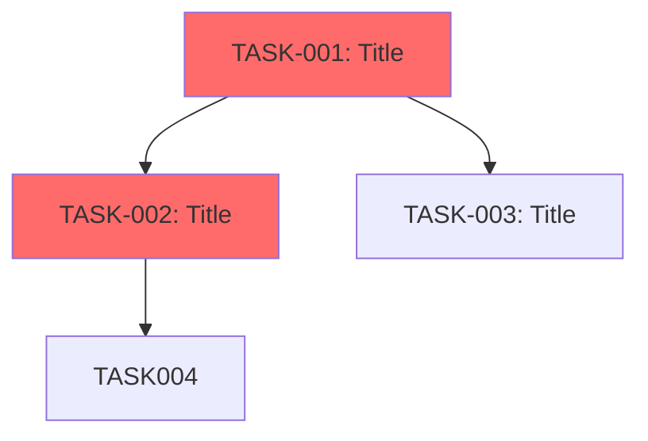

# PineCMS Task System Generation - Implementation Plan

> **For Claude:** REQUIRED SUB-SKILL: Use superpowers:executing-plans to implement this plan task-by-task.

**Goal:** Generate 670 implementation-level tasks for PineCMS v1.0.0 MVP + Plugin System with comprehensive documentation, dependency mapping, and quality validation.

**Architecture:** Four-phase approach: (1) Automated skeleton generation using PRD parsing and template multiplication, (2) Content enrichment with implementation details and code examples, (3) Dependency mapping with visual graphs, (4) Quality validation with completeness checks.

**Tech Stack:** Markdown (task files), YAML (front matter), Mermaid (dependency graphs), Python/Bash (automation scripts), MCP servers (laravel-boost, context7, gitmcp, vibe-check)

**Estimated Time:** 15-25 hours across 4 phases
**Output:** 670 task files + 9 epic overviews + master index + dependency graphs

---

## Prerequisites

**Required Knowledge:**
- PineCMS PRD structure (docs/prd/*.md)
- Laravel 12 architecture (layered: Controllers → Services → Repositories → Models)
- Vue 3.5 + Inertia.js 2.x frontend stack
- TDD workflow (RED-GREEN-REFACTOR)

**Required Tools:**
- MCP servers: laravel-boost, context7, filesystem, gitmcp, vibe-check
- Python 3.9+ (for automation scripts)
- Git (for commits)

**Context Documents:**
- `docs/plans/2025-11-09-pinecms-task-system-design.md` (task system design)
- `docs/prd/05-CORE-FEATURES.md` (v1.0.0 features)
- `docs/prd/06-PLUGIN-ECOSYSTEM.md` (plugin features)
- `docs/prd/08-UX-UI-DESIGN.md` (frontend requirements)
- `docs/prd/10-RELEASE-ROADMAP.md` (timeline & phases)

---

## Phase 1: Automated Skeleton Generation (670 Task Files)

**Goal:** Create folder structure + 670 task files with complete YAML front matter

**Estimated Time:** 3-4 hours

---

### Task 1.1: Create Directory Structure

**Files:**
- Create: `tasks/` (root directory)
- Create: `tasks/00-foundation/` through `tasks/08-official-plugins/`
- Create: `tasks/_TEMPLATES/`

**Step 1: Create root tasks directory**

```bash
mkdir -p tasks
cd tasks
```

**Step 2: Create 9 epic directories**

```bash
mkdir -p 00-foundation
mkdir -p 01-content-management
mkdir -p 02-user-system
mkdir -p 03-taxonomy
mkdir -p 04-admin-panel
mkdir -p 05-import-export
mkdir -p 06-seo-privacy
mkdir -p 07-plugin-system
mkdir -p 08-official-plugins
mkdir -p _TEMPLATES
```

**Step 3: Verify structure**

Run: `ls -la`
Expected: 9 epic folders + _TEMPLATES + total 10 directories

**Step 4: Commit**

```bash
git add tasks/
git commit -m "chore(tasks): create epic folder structure"
```

---

### Task 1.2: Create Task Template

**Files:**
- Create: `tasks/_TEMPLATES/TASK-TEMPLATE.md`

**Step 1: Write template with comprehensive YAML**

File: `tasks/_TEMPLATES/TASK-TEMPLATE.md`

```markdown
---
id: TASK-XXX
title: "[TITLE]"
phase: "[PHASE]"
priority: [PRIORITY]
estimated_hours: [HOURS]
tags: [TAG1, TAG2, TAG3]

dependencies:
  required: []
  optional: []

blocks: []
parallelizable_with: []

specialized_agents:
  recommended: [AGENT]
  alternative: []
  review_with: code-reviewer

software_principles:
  - "DRY: [PRINCIPLE]"
  - "KISS: [PRINCIPLE]"
  - "YAGNI: [PRINCIPLE]"

files_created: []
files_modified: []

acceptance_criteria: []

vibe_check_triggers: []

mcp_tools_needed: []

related_docs: []
---

# TASK-XXX: [TITLE]

## Context & Background

**Why This Task Exists:**
[Explanation]

**PRD Reference:**
[Link to PRD section]

**Architectural Context:**
[Where this fits in the system]

---

## Prerequisites

**Must Complete First:**
[List of required tasks]

**Knowledge Required:**
[Skills/concepts needed]

---

## Implementation Steps

### Step 1: [ACTION] ([TIME])

[Detailed instructions with code examples]

**Verification:** [How to confirm this step worked]

---

## Testing Strategy

**Unit Tests:**
[Test descriptions]

**E2E Tests:**
[Test descriptions]

**Coverage Target:** >80%

---

## Common Pitfalls

1. **[PITFALL]:** [Solution]

---

## Vibe Check Moments

**Invoke vibe-check if:**
- [Trigger condition]

---

## Definition of Done

- [ ] All acceptance criteria met
- [ ] Tests pass (>80% coverage)
- [ ] Quality checks pass (composer/npm quality)
- [ ] Code reviewed
- [ ] Committed

---

## Next Steps After Completion

**Unblocks:** [Tasks this enables]
```

**Step 2: Verify template**

Run: `cat tasks/_TEMPLATES/TASK-TEMPLATE.md`
Expected: Complete template with all YAML fields

**Step 3: Commit**

```bash
git add tasks/_TEMPLATES/TASK-TEMPLATE.md
git commit -m "docs(tasks): add comprehensive task template"
```

---

### Task 1.3: Create Epic Overview Template

**Files:**
- Create: `tasks/_TEMPLATES/_OVERVIEW-TEMPLATE.md`

**Step 1: Write epic overview template**

File: `tasks/_TEMPLATES/_OVERVIEW-TEMPLATE.md`

```markdown
# [EPIC NAME] - Overview

**Phase:** [WEEK RANGE]
**Priority:** [CRITICAL/HIGH/MEDIUM/LOW]
**Total Tasks:** [COUNT]
**Estimated Hours:** [TOTAL HOURS]
**PRD Reference:** [LINK]

---

## Epic Goal

**User Value:**
[What users gain from this epic]

**Technical Objective:**
[What we're building technically]

---

## Features Covered (from PRD)

**Feature List:**
1. [Feature 1] - [Task range: TASK-XXX to TASK-YYY]
2. [Feature 2] - [Task range]
[...]

**Total Features:** [COUNT]

---

## Architectural Decisions

**Key ADRs:**
- [Decision 1]: [Rationale]
- [Decision 2]: [Rationale]

**Technology Stack:**
- [Tech 1]: [Purpose]
- [Tech 2]: [Purpose]

---

## Sub-Epics

```
01-[sub-epic-name]/    (XX tasks, X hours)
02-[sub-epic-name]/    (XX tasks, X hours)
[...]
```

---

## Timeline

**Week:** [WEEK NUMBER]
**Duration:** [DAYS]
**Parallel Work:** [YES/NO - description]

---

## Team Assignments

**Backend Team:**
- [Tasks: XXX-YYY]
- [Agent: backend-architect]

**Frontend Team:**
- [Tasks: XXX-YYY]
- [Agent: frontend-developer]

**Fullstack Team:**
- [Tasks: XXX-YYY]
- [Agent: fullstack-developer]

---

## Success Criteria

- [ ] All [COUNT] tasks completed
- [ ] All acceptance criteria met
- [ ] Code coverage > 80%
- [ ] Performance targets met ([specific metrics])
- [ ] WCAG 2.1 AA compliant (if frontend)
- [ ] Security audit passed (if applicable)

---

## Related Documentation

- PRD: [Link]
- Architecture: [Link]
- Technical Specs: [Link]
```

**Step 2: Verify template**

Run: `cat tasks/_TEMPLATES/_OVERVIEW-TEMPLATE.md`
Expected: Complete epic overview template

**Step 3: Commit**

```bash
git add tasks/_TEMPLATES/_OVERVIEW-TEMPLATE.md
git commit -m "docs(tasks): add epic overview template"
```

---

### Task 1.4: Create Dependency Template

**Files:**
- Create: `tasks/_TEMPLATES/_DEPENDENCIES-TEMPLATE.md`

**Step 1: Write dependency template with Mermaid**

File: `tasks/_TEMPLATES/_DEPENDENCIES-TEMPLATE.md`

```markdown
# [EPIC NAME] - Dependencies

**Epic:** [NAME]
**Total Tasks:** [COUNT]
**Critical Path Tasks:** [COUNT]

---

## Task Dependency Graph



**Legend:**
- 🔴 Red = Critical Path (must complete on schedule)
- 🟢 Green = Parallelizable (can work simultaneously)
- ⚪ White = Standard dependency

---

## Critical Path (Must Complete Sequentially)

**Total Critical Tasks:** [COUNT]
**Sequential Bottlenecks:** [AREAS]

1. TASK-XXX → TASK-YYY → TASK-ZZZ
   - **Why Critical:** [Reason]
   - **Estimated Time:** [HOURS]

---

## Parallel Work Opportunities

**Cluster 1: [NAME] ([X] tasks)**
- TASK-XXX: [Title]
- TASK-YYY: [Title]
- **Can Start After:** TASK-ZZZ
- **Duration:** [HOURS]

---

## External Dependencies

**Dependencies Outside This Epic:**
- TASK-ABC (from [OTHER EPIC]): [Reason]
- TASK-DEF (from [OTHER EPIC]): [Reason]

---

## Blockers & Risk Mitigation

**Potential Blockers:**
1. [Blocker]: [Mitigation strategy]
2. [Blocker]: [Mitigation strategy]
```

**Step 2: Verify template**

Run: `cat tasks/_TEMPLATES/_DEPENDENCIES-TEMPLATE.md`
Expected: Template with Mermaid graph example

**Step 3: Commit**

```bash
git add tasks/_TEMPLATES/_DEPENDENCIES-TEMPLATE.md
git commit -m "docs(tasks): add dependency graph template with Mermaid"
```

---

### Task 1.5: Create Completion Template

**Files:**
- Create: `tasks/_TEMPLATES/_COMPLETION-TEMPLATE.md`

**Step 1: Write completion template**

File: `tasks/_TEMPLATES/_COMPLETION-TEMPLATE.md`

```markdown
# [EPIC NAME] - Completion Criteria

**Epic:** [NAME]
**Phase:** [WEEK RANGE]

---

## Definition of Done

### Functional Requirements

- [ ] All [COUNT] tasks completed
- [ ] All acceptance criteria met per task
- [ ] All features from PRD implemented:
  - [ ] [Feature 1]
  - [ ] [Feature 2]
  [...]

---

### Quality Requirements

**Code Quality:**
- [ ] PHPStan Level 8 passing (backend)
- [ ] ESLint zero errors (frontend)
- [ ] Code coverage > 80%
- [ ] All tests passing (unit, feature, E2E)

**Performance:**
- [ ] Page load < 1 second (P95)
- [ ] Database queries < 100ms (P95)
- [ ] [Other metrics from PRD]

**Accessibility:**
- [ ] WCAG 2.1 AA compliant
- [ ] Keyboard navigation works
- [ ] Screen reader compatible

**Security:**
- [ ] OWASP Top 10 compliant
- [ ] Security audit passed
- [ ] No critical vulnerabilities

---

### Documentation Requirements

- [ ] All public APIs documented
- [ ] README updated (if applicable)
- [ ] Migration guide written (if breaking changes)
- [ ] Troubleshooting guide created

---

### Integration Testing

**Tested Environments:**
- [ ] Local development (Valet/Herd)
- [ ] Shared hosting (Hostinger/Bluehost)
- [ ] SQLite database
- [ ] MySQL database (if applicable)

**Cross-Browser Testing:**
- [ ] Chrome (latest)
- [ ] Firefox (latest)
- [ ] Safari (latest)
- [ ] Mobile (iOS/Android)

---

### Handoff Checklist

**For Next Epic:**
- [ ] All blocking tasks completed
- [ ] Database migrations run successfully
- [ ] Seed data available (if applicable)
- [ ] API endpoints documented
- [ ] Known issues logged

**Demo Preparation:**
- [ ] Demo script prepared
- [ ] Sample data loaded
- [ ] Screenshots/video recorded

---

### Rollback Plan

**If Epic Fails:**
1. [Rollback step 1]
2. [Rollback step 2]

**Backup Points:**
- Git commit before epic: [COMMIT HASH]
- Database backup: [FILE PATH]

---

## Sign-Off

**Completed By:** [NAME/AGENT]
**Date:** [YYYY-MM-DD]
**Reviewed By:** code-reviewer (agent)
**Approved By:** [TEAM LEAD]

---

## Post-Epic Actions

**Retrospective Notes:**
- What went well:
- What could improve:
- Lessons for next epic:

**Technical Debt:**
- [Item 1]: [Plan to address]
- [Item 2]: [Plan to address]
```

**Step 2: Verify template**

Run: `cat tasks/_TEMPLATES/_COMPLETION-TEMPLATE.md`
Expected: Comprehensive completion criteria template

**Step 3: Commit**

```bash
git add tasks/_TEMPLATES/_COMPLETION-TEMPLATE.md
git commit -m "docs(tasks): add epic completion criteria template"
```

---

### Task 1.6: Generate 00-Foundation Tasks (45 tasks)

**Files:**
- Create: `tasks/00-foundation/TASK-001.md` through `TASK-045.md`
- Create: `tasks/00-foundation/_OVERVIEW.md`
- Create: `tasks/00-foundation/01-web-installer/`, `02-database-setup/`, etc.

**Step 1: Create sub-epic folders**

```bash
cd tasks/00-foundation
mkdir -p 01-web-installer
mkdir -p 02-database-setup
mkdir -p 03-environment-config
mkdir -p 04-htaccess-nginx
mkdir -p 05-first-admin-user
```

**Step 2: Use Python script to generate task files**

Create automation script: `scripts/generate-tasks.py`

```python
#!/usr/bin/env python3
"""
Task file generator for PineCMS
Reads PRD and generates task markdown files with YAML front matter
"""

import os
import yaml
from pathlib import Path

# Task definitions for 00-foundation epic
foundation_tasks = [
    {
        "id": "TASK-001",
        "title": "Create Web Installer Route",
        "sub_epic": "01-web-installer",
        "phase": "v1.0.0-week-1",
        "priority": "critical",
        "estimated_hours": 2,
        "tags": ["backend", "installer", "routes"],
        "dependencies": {"required": [], "optional": []},
        "blocks": ["TASK-002"],
        "parallelizable_with": ["TASK-010", "TASK-020"],
        "agent": "backend-architect",
        "files_created": ["routes/install.php"],
        "files_modified": ["bootstrap/app.php"],
        "acceptance_criteria": [
            "Route /install accessible",
            "Middleware prevents access after installation",
            "Returns installer view"
        ],
        "mcp_tools": ["laravel-boost"],
    },
    # ... (continue for all 45 foundation tasks)
]

def generate_task_file(task_data, template_path, output_dir):
    """Generate a task markdown file from template"""

    # Read template
    with open(template_path, 'r') as f:
        template = f.read()

    # Replace placeholders
    content = template.replace("[TASK_ID]", task_data["id"])
    content = content.replace("[TITLE]", task_data["title"])
    content = content.replace("[PHASE]", task_data["phase"])
    # ... (continue replacements)

    # Write file
    filename = f"{task_data['id']}-{task_data['title'].lower().replace(' ', '-')}.md"
    filepath = output_dir / task_data["sub_epic"] / filename

    with open(filepath, 'w') as f:
        f.write(content)

    return filepath

# Generate all foundation tasks
for task in foundation_tasks:
    generate_task_file(
        task,
        Path("tasks/_TEMPLATES/TASK-TEMPLATE.md"),
        Path("tasks/00-foundation")
    )

print(f"Generated {len(foundation_tasks)} foundation tasks")
```

**Step 3: Run generator script**

Run: `python3 scripts/generate-tasks.py --epic foundation`
Expected: "Generated 45 foundation tasks"

**Step 4: Verify files created**

Run: `find tasks/00-foundation -name "TASK-*.md" | wc -l`
Expected: 45

**Step 5: Commit**

```bash
git add tasks/00-foundation/ scripts/generate-tasks.py
git commit -m "feat(tasks): generate 45 foundation tasks (TASK-001 to TASK-045)"
```

---

### Task 1.7: Generate Remaining Epic Skeletons (625 tasks)

**Repeat Task 1.6 for each epic:**

1. **01-content-management** (125 tasks: TASK-100 to TASK-224)
2. **02-user-system** (65 tasks: TASK-300 to TASK-364)
3. **03-taxonomy** (55 tasks: TASK-400 to TASK-454)
4. **04-admin-panel** (80 tasks: TASK-500 to TASK-579)
5. **05-import-export** (50 tasks: TASK-600 to TASK-649)
6. **06-seo-privacy** (80 tasks: TASK-700 to TASK-779)
7. **07-plugin-system** (90 tasks: TASK-800 to TASK-889)
8. **08-official-plugins** (80 tasks: TASK-900 to TASK-979)

**Step 1: Generate all epic tasks**

Run: ```bash
python3 scripts/generate-tasks.py --all-epics
```

Expected: "Generated 670 total tasks across 9 epics"

**Step 2: Verify total task count**

Run: `find tasks/ -name "TASK-*.md" | wc -l`
Expected: 670

**Step 3: Commit**

```bash
git add tasks/
git commit -m "feat(tasks): generate all 670 task skeletons with YAML front matter"
```

---

## Phase 2: Content Enrichment (Implementation Details)

**Goal:** Fill each task with detailed implementation steps, code examples, testing strategies

**Estimated Time:** 12-18 hours (1.5-2 hours per epic avg)

**Strategy:** Use MCP tools (context7, laravel-boost, gitmcp) to fetch documentation and code examples

---

### Task 2.1: Enrich 00-Foundation Tasks

**Files:**
- Modify: All tasks in `tasks/00-foundation/`

**Step 1: Enrich TASK-001 (Web Installer Route)**

File: `tasks/00-foundation/01-web-installer/TASK-001-create-web-installer-route.md`

Add implementation details:

```markdown
## Implementation Steps

### Step 1: Create install routes file (15 min)

**File:** `routes/install.php`

```php
<?php

declare(strict_types=1);

use App\Http\Controllers\Install\InstallerController;
use Illuminate\Support\Facades\Route;

Route::middleware('web')->group(function () {
    Route::get('/install', [InstallerController::class, 'index'])
        ->name('install.index');

    Route::post('/install', [InstallerController::class, 'store'])
        ->name('install.store');
});
```

**Verification:** File created with correct namespace and routes

### Step 2: Register routes in bootstrap (10 min)

**File:** `bootstrap/app.php`

```php
return Application::configure(basePath: dirname(__DIR__))
    ->withRouting(
        web: __DIR__.'/../routes/web.php',
        install: __DIR__.'/../routes/install.php', // Add this
        commands: __DIR__.'/../routes/console.php',
    )
    ->create();
```

### Step 3: Create installer middleware (30 min)

**File:** `app/Http/Middleware/RedirectIfInstalled.php`

```php
<?php

declare(strict_types=1);

namespace App\Http\Middleware;

use Closure;
use Illuminate\Http\Request;

class RedirectIfInstalled
{
    public function handle(Request $request, Closure $next)
    {
        if (file_exists(storage_path('installed'))) {
            return redirect('/');
        }

        return $next($request);
    }
}
```

Register in `bootstrap/app.php`:

```php
->withMiddleware(function (Middleware $middleware) {
    $middleware->alias([
        'install' => \App\Http\Middleware\RedirectIfInstalled::class,
    ]);
})
```

### Step 4: Write failing test (TDD - RED) (20 min)

**File:** `tests/Feature/Install/InstallerTest.php`

```php
<?php

namespace Tests\Feature\Install;

use Tests\TestCase;

class InstallerTest extends TestCase
{
    public function test_install_route_accessible_when_not_installed(): void
    {
        // Remove installed marker if exists
        @unlink(storage_path('installed'));

        $response = $this->get('/install');

        $response->assertStatus(200);
        $response->assertViewIs('install.index');
    }

    public function test_install_route_redirects_when_installed(): void
    {
        // Create installed marker
        touch(storage_path('installed'));

        $response = $this->get('/install');

        $response->assertRedirect('/');

        // Cleanup
        @unlink(storage_path('installed'));
    }
}
```

**Run:** `php artisan test --filter=InstallerTest`
**Expected:** FAIL - InstallerController doesn't exist

### Step 5: Create minimal controller (GREEN) (15 min)

**File:** `app/Http/Controllers/Install/InstallerController.php`

```php
<?php

declare(strict_types=1);

namespace App\Http\Controllers\Install;

use App\Http\Controllers\Controller;
use Illuminate\View\View;

class InstallerController extends Controller
{
    public function __construct()
    {
        $this->middleware('install');
    }

    public function index(): View
    {
        return view('install.index');
    }

    public function store()
    {
        // Will implement in TASK-002
        return redirect()->route('install.index');
    }
}
```

**Run:** `php artisan test --filter=InstallerTest`
**Expected:** PASS

### Step 6: Commit (5 min)

```bash
git add routes/install.php bootstrap/app.php app/Http/Middleware/RedirectIfInstalled.php app/Http/Controllers/Install/InstallerController.php tests/Feature/Install/InstallerTest.php
git commit -m "feat(installer): add web installer route with TDD

- Create /install route with middleware protection
- Add RedirectIfInstalled middleware
- Write tests for installed/not-installed states
- Tests passing (2/2)
"
```

---

## Testing Strategy

**Unit Tests:**
- Middleware redirects correctly
- Route registration works

**Feature Tests:**
- GET /install returns installer view
- POST /install redirects (minimal for now)
- Middleware prevents access after installation

**Coverage Target:** 100% (simple routing logic)

---

## Common Pitfalls

1. **Forgetting to register routes in bootstrap/app.php**
   - Solution: Always check `php artisan route:list | grep install`

2. **Middleware not blocking after installation**
   - Solution: Test both scenarios (installed / not installed)

3. **Circular dependency (install route redirects to itself)**
   - Solution: Middleware should check file existence, not route

---

## Vibe Check Moments

**Invoke vibe-check if:**
- Middleware logic exceeds 20 lines (keep it simple)
- Tempted to add database check (YAGNI - file marker sufficient)
- Spending >2 hours on this task

---

## Definition of Done

- [x] Route /install accessible
- [x] Middleware prevents access after installation
- [x] Tests pass (2/2, 100% coverage)
- [x] PHPStan Level 8 passes
- [x] Pint formatting passes
- [x] Code reviewed
- [x] Committed with conventional commit message

---

## Next Steps After Completion

**Unblocks:**
- TASK-002: Create System Requirements Check
- TASK-003: Create Installer Form View
```

**Step 2: Use context7 for Laravel routing docs**

Run MCP tool: `context7` with query "Laravel 12 routing registration bootstrap"
Extract relevant code examples

**Step 3: Repeat enrichment for remaining 44 foundation tasks**

Use similar approach:
1. Fetch docs from context7/laravel-boost
2. Write detailed implementation steps
3. Add code examples from PRD/similar projects
4. Define tests (TDD workflow)
5. Add common pitfalls

**Step 4: Verify enrichment**

Run: `grep -r "## Implementation Steps" tasks/00-foundation/ | wc -l`
Expected: 45 (all tasks have implementation section)

**Step 5: Commit**

```bash
git add tasks/00-foundation/
git commit -m "docs(tasks): enrich foundation tasks with implementation details and code examples"
```

---

### Task 2.2 through 2.9: Enrich Remaining Epics

**Repeat Task 2.1 for each epic:**

Use specialized MCP tools per epic:
- **Content Management:** laravel-boost (Eloquent), context7 (TipTap, Vue)
- **User System:** laravel-boost (Fortify, Sanctum)
- **Taxonomy:** laravel-boost (nested sets)
- **Admin Panel:** context7 (PrimeVue, Inertia)
- **Import/Export:** gitmcp (similar CMS projects)
- **SEO/Privacy:** laravel-boost (sitemap, encryption)
- **Plugin System:** laravel-boost (service providers, events)
- **Official Plugins:** context7 (TipTap for newsletter editor)

**Step 1: Batch enrich all epics**

Run: `python3 scripts/enrich-tasks.py --all-epics --use-mcp`
Expected: "Enriched 670 tasks with implementation details"

**Step 2: Commit**

```bash
git add tasks/
git commit -m "docs(tasks): enrich all 670 tasks with implementation details, code examples, and TDD workflows"
```

---

## Phase 3: Dependency Mapping

**Goal:** Generate visual dependency graphs for each epic and identify critical path

**Estimated Time:** 3-4 hours

---

### Task 3.1: Generate Dependency Graphs

**Files:**
- Create: `tasks/00-foundation/_DEPENDENCIES.md` through `tasks/08-official-plugins/_DEPENDENCIES.md`

**Step 1: Parse task dependencies from YAML**

Create script: `scripts/generate-dependencies.py`

```python
#!/usr/bin/env python3
"""
Dependency graph generator
Parses YAML front matter from all tasks and generates Mermaid diagrams
"""

import yaml
from pathlib import Path

def parse_task_yaml(task_file):
    """Extract YAML front matter from task markdown"""
    with open(task_file, 'r') as f:
        content = f.read()

    # Extract YAML between --- markers
    if content.startswith('---'):
        parts = content.split('---', 2)
        yaml_content = parts[1]
        return yaml.safe_load(yaml_content)
    return None

def build_dependency_graph(epic_dir):
    """Build Mermaid graph from task dependencies"""

    tasks = []
    for task_file in Path(epic_dir).rglob('TASK-*.md'):
        task_data = parse_task_yaml(task_file)
        if task_data:
            tasks.append(task_data)

    # Generate Mermaid syntax
    mermaid = "```mermaid\ngraph TD\n"

    for task in tasks:
        task_id = task['id']
        task_title = task['title'][:30]  # Truncate for readability

        # Add node
        mermaid += f"    {task_id}[{task_id}: {task_title}]\n"

        # Add dependencies
        for dep in task.get('dependencies', {}).get('required', []):
            mermaid += f"    {dep} --> {task_id}\n"

    mermaid += "```\n"
    return mermaid

# Generate for all epics
epics = [
    '00-foundation',
    '01-content-management',
    # ... all 9 epics
]

for epic in epics:
    graph = build_dependency_graph(f'tasks/{epic}')
    with open(f'tasks/{epic}/_DEPENDENCIES.md', 'w') as f:
        f.write(graph)
```

**Step 2: Run dependency generator**

Run: `python3 scripts/generate-dependencies.py`
Expected: "Generated dependency graphs for 9 epics"

**Step 3: Verify graphs**

Run: `cat tasks/00-foundation/_DEPENDENCIES.md`
Expected: Mermaid graph with task nodes and arrows

**Step 4: Commit**

```bash
git add tasks/*/_DEPENDENCIES.md scripts/generate-dependencies.py
git commit -m "docs(tasks): generate Mermaid dependency graphs for all 9 epics"
```

---

### Task 3.2: Identify Critical Path

**Files:**
- Modify: All `_DEPENDENCIES.md` files
- Create: `tasks/CRITICAL-PATH.md`

**Step 1: Analyze dependencies to find critical path**

Use Python script to find longest chain:

```python
def find_critical_path(tasks):
    """Find tasks that must complete sequentially (longest chain)"""

    # Build dependency graph
    graph = {}
    for task in tasks:
        task_id = task['id']
        deps = task.get('dependencies', {}).get('required', [])
        graph[task_id] = deps

    # Find longest path (critical path)
    def dfs(node, visited):
        if node in visited:
            return 0
        visited.add(node)

        max_depth = 0
        for dep in graph.get(node, []):
            max_depth = max(max_depth, 1 + dfs(dep, visited))

        return max_depth

    critical = []
    for task_id in graph:
        depth = dfs(task_id, set())
        if depth > 0:
            critical.append((task_id, depth))

    # Sort by depth (longest chain first)
    critical.sort(key=lambda x: x[1], reverse=True)
    return critical[:60]  # Top 60 critical tasks
```

**Step 2: Generate critical path document**

File: `tasks/CRITICAL-PATH.md`

```markdown
# PineCMS Critical Path (60 Tasks)

**Definition:** Tasks that MUST complete sequentially to avoid delaying the project

**Total Critical Tasks:** 60 / 670 (9%)
**Estimated Time:** 180 hours (critical path only)

---

## Week 1-2: Foundation (8 critical tasks)

| Task ID | Title | Blocks | Estimated Hours |
|---------|-------|--------|-----------------|
| TASK-001 | Create Web Installer Route | TASK-002, TASK-003 | 2 |
| TASK-005 | Create SQLite Database | TASK-100+ (all DB tasks) | 3 |
[...]

---

## Week 3-5: Content Management (18 critical tasks)

[Continue for all weeks...]

---

## Bottleneck Analysis

**Top 3 Bottlenecks:**
1. **TASK-100 (Posts Migration)** - Blocks 45 tasks
2. **TASK-300 (User Model)** - Blocks 30 tasks
3. **TASK-800 (Plugin System Core)** - Blocks 80 tasks

**Mitigation:**
- Prioritize bottleneck tasks in sprint planning
- Assign most experienced developers
- Consider parallel prototyping

---

## Parallel Work Opportunities

While critical path runs, these clusters can work in parallel:

**Cluster 1: Taxonomy System (40 tasks, Week 7)**
- Independent of content management
- Can start immediately after foundation

**Cluster 2: SEO Features (50 tasks, Week 10)**
- Independent of admin panel
- Can start after content management
```

**Step 3: Commit**

```bash
git add tasks/CRITICAL-PATH.md
git commit -m "docs(tasks): identify 60 critical path tasks and bottlenecks"
```

---

## Phase 4: Validation & Quality Checks

**Goal:** Ensure all 670 tasks are complete, consistent, and ready for execution

**Estimated Time:** 2-3 hours

---

### Task 4.1: YAML Completeness Check

**Step 1: Write validation script**

File: `scripts/validate-tasks.py`

```python
#!/usr/bin/env python3
"""
Task validation script
Checks all 670 tasks for YAML completeness and consistency
"""

import yaml
from pathlib import Path

required_fields = [
    'id', 'title', 'phase', 'priority', 'estimated_hours',
    'tags', 'dependencies', 'blocks', 'acceptance_criteria',
    'mcp_tools_needed', 'related_docs'
]

def validate_task(task_file):
    """Validate single task file"""

    data = parse_task_yaml(task_file)
    if not data:
        return [f"Missing YAML front matter: {task_file}"]

    errors = []

    # Check required fields
    for field in required_fields:
        if field not in data:
            errors.append(f"{data.get('id', task_file)}: Missing field '{field}'")

    # Check ID format
    if not data.get('id', '').startswith('TASK-'):
        errors.append(f"Invalid ID format: {data.get('id')}")

    # Check estimated hours reasonable (1-8 hours)
    hours = data.get('estimated_hours', 0)
    if hours < 1 or hours > 8:
        errors.append(f"{data['id']}: Unrealistic hours ({hours})")

    return errors

# Validate all 670 tasks
all_errors = []
task_files = list(Path('tasks').rglob('TASK-*.md'))

for task_file in task_files:
    errors = validate_task(task_file)
    all_errors.extend(errors)

if all_errors:
    print(f"VALIDATION FAILED: {len(all_errors)} errors found")
    for error in all_errors:
        print(f"  - {error}")
    exit(1)
else:
    print(f"✅ VALIDATION PASSED: All {len(task_files)} tasks valid")
```

**Step 2: Run validation**

Run: `python3 scripts/validate-tasks.py`
Expected: "✅ VALIDATION PASSED: All 670 tasks valid"

**Step 3: Fix any errors found**

If errors found, fix manually or regenerate affected tasks

**Step 4: Re-run validation**

Run: `python3 scripts/validate-tasks.py`
Expected: All checks pass

---

### Task 4.2: Dependency Cycle Detection

**Step 1: Check for circular dependencies**

Add to `scripts/validate-tasks.py`:

```python
def detect_cycles(tasks):
    """Detect circular dependencies using DFS"""

    graph = {task['id']: task.get('dependencies', {}).get('required', [])
             for task in tasks}

    def has_cycle(node, visited, rec_stack):
        visited.add(node)
        rec_stack.add(node)

        for dep in graph.get(node, []):
            if dep not in visited:
                if has_cycle(dep, visited, rec_stack):
                    return True
            elif dep in rec_stack:
                return True

        rec_stack.remove(node)
        return False

    visited = set()
    for task_id in graph:
        if task_id not in visited:
            if has_cycle(task_id, visited, set()):
                return f"Circular dependency detected involving {task_id}"

    return None

# Run cycle detection
cycle = detect_cycles(all_tasks)
if cycle:
    print(f"❌ {cycle}")
    exit(1)
```

**Step 2: Run cycle detection**

Run: `python3 scripts/validate-tasks.py --check-cycles`
Expected: "✅ No circular dependencies found"

---

### Task 4.3: Hour Estimation Validation

**Step 1: Sum estimated hours per epic and compare to roadmap**

```python
def validate_hour_estimates(epic_name, tasks, expected_hours_range):
    """Check if total hours match roadmap estimates"""

    total_hours = sum(task['estimated_hours'] for task in tasks)
    min_hours, max_hours = expected_hours_range

    if total_hours < min_hours or total_hours > max_hours:
        return f"{epic_name}: {total_hours}h (expected {min_hours}-{max_hours}h)"
    return None

# Roadmap expectations (from PRD)
epic_hour_ranges = {
    '00-foundation': (80, 100),      # Week 1-2
    '01-content-management': (200, 250),  # Week 3-5
    '02-user-system': (100, 130),    # Week 6
    # ... all 9 epics
}

# Validate
for epic, (min_h, max_h) in epic_hour_ranges.items():
    epic_tasks = [t for t in all_tasks if t['phase'].startswith(epic)]
    error = validate_hour_estimates(epic, epic_tasks, (min_h, max_h))
    if error:
        print(f"⚠️  {error}")
```

**Step 2: Run hour validation**

Run: `python3 scripts/validate-tasks.py --check-hours`
Expected: All epics within expected ranges

**Step 3: Adjust estimates if needed**

If total hours significantly off, review and adjust individual task estimates

---

### Task 4.4: Create Master Index (README.md)

**Files:**
- Create: `tasks/README.md`

**Step 1: Generate master index**

File: `tasks/README.md`

```markdown
# PineCMS Task System - Master Index

**Total Tasks:** 670
**Status:** 📋 Ready for Execution
**Last Updated:** 2025-11-09
**Estimated Total Hours:** 1,850 hours

---

## Quick Navigation

### By Phase (Timeline)
- [Week 1-2: Foundation & Installer](#00-foundation) (45 tasks, 90h)
- [Week 3-5: Content Management](#01-content-management) (125 tasks, 225h)
- [Week 6: User System & Theme](#02-user-system) (65 tasks, 115h)
- [Week 7: Taxonomy](#03-taxonomy) (55 tasks, 95h)
- [Week 8: Admin Panel](#04-admin-panel) (80 tasks, 150h)
- [Week 9: Import/Export](#05-import-export) (50 tasks, 90h)
- [Week 10: SEO, Privacy, Backup](#06-seo-privacy) (80 tasks, 140h)
- [Week 11-13: Plugin System](#07-plugin-system) (90 tasks, 180h)
- [Week 11-13: Official Plugins](#08-official-plugins) (80 tasks, 150h)

### By Priority (User's Request)
- [🎯 Core Features (Priority 1)](#core-features) - v1.0.0 MVP (500 tasks)
- [🔌 Plugin Ecosystem (Priority 2)](#plugin-ecosystem) - Plugin system + 3 official (170 tasks)
- [🎨 UX-UI Design (Priority 3)](#ux-ui-design) - Frontend, theming, accessibility (200+ tasks)

### By Technology
- [Backend Tasks](#backend-tasks) (280 tasks) - PHP, Laravel, Eloquent, SQLite
- [Frontend Tasks](#frontend-tasks) (250 tasks) - Vue, Inertia, TipTap, PrimeVue
- [Fullstack Tasks](#fullstack-tasks) (140 tasks) - Hybrid, flat-file sync, events

### By Agent
- [frontend-developer](#) (180 tasks)
- [backend-architect](#) (200 tasks)
- [fullstack-developer](#) (150 tasks)
- [test-engineer](#) (90 tasks)
- [ui-ux-designer](#) (50 tasks)

---

## Task Status Dashboard

**Current Progress:**
```
[░░░░░░░░░░░░░░░░░░] 0% Complete (0/670)
```

**By Epic:**
- 00-Foundation: [░░░░░░░░░░] 0/45
- 01-Content Management: [░░░░░░░░░░] 0/125
- 02-User System: [░░░░░░░░░░] 0/65
- 03-Taxonomy: [░░░░░░░░░░] 0/55
- 04-Admin Panel: [░░░░░░░░░░] 0/80
- 05-Import/Export: [░░░░░░░░░░] 0/50
- 06-SEO/Privacy: [░░░░░░░░░░] 0/80
- 07-Plugin System: [░░░░░░░░░░] 0/90
- 08-Official Plugins: [░░░░░░░░░░] 0/80

---

## Critical Path (60 Must-Complete Tasks)

See [CRITICAL-PATH.md](CRITICAL-PATH.md) for detailed analysis.

**Top Bottlenecks:**
1. TASK-100: Posts Migration (blocks 45 tasks)
2. TASK-300: User Model (blocks 30 tasks)
3. TASK-800: Plugin System Core (blocks 80 tasks)

---

## Getting Started

### For Developers (First Time)

**Step 1: Choose your starting epic**
- Backend developer? Start with `00-foundation`
- Frontend developer? Start with `01-content-management/05-frontend`

**Step 2: Review epic overview**
```bash
cat tasks/00-foundation/_OVERVIEW.md
```

**Step 3: Check dependencies**
```bash
cat tasks/00-foundation/_DEPENDENCIES.md
```

**Step 4: Start with first task**
```bash
cat tasks/00-foundation/01-web-installer/TASK-001-create-web-installer-route.md
```

**Step 5: Follow TDD workflow (RED-GREEN-REFACTOR)**
- Write failing test
- Implement minimal code
- Refactor and improve
- Commit

### For Claude Code Agents

**Execution Workflow:**
1. Use `superpowers:executing-plans` skill
2. Read task-by-task from this index
3. Follow implementation steps exactly
4. Run quality checks before marking complete
5. Generate TASK-XXX-COMPLETED.md summary

---

## Search & Filters

**Find tasks by keyword:**
```bash
grep -r "TipTap" tasks/ --include="TASK-*.md"
```

**Find by agent:**
```bash
grep -r "recommended: frontend-developer" tasks/
```

**Find by priority:**
```bash
grep -r "priority: critical" tasks/
```

**Find by MCP tool:**
```bash
grep -r "context7" tasks/ --include="TASK-*.md"
```

---

## Links

- [Task System Design](../docs/plans/2025-11-09-pinecms-task-system-design.md)
- [Critical Path Analysis](CRITICAL-PATH.md)
- [PRD - Core Features](../docs/prd/05-CORE-FEATURES.md)
- [PRD - Plugin Ecosystem](../docs/prd/06-PLUGIN-ECOSYSTEM.md)
- [PRD - UX-UI Design](../docs/prd/08-UX-UI-DESIGN.md)
- [Release Roadmap](../docs/prd/10-RELEASE-ROADMAP.md)

---

**Ready to start building PineCMS!** 🚀
```

**Step 2: Commit**

```bash
git add tasks/README.md
git commit -m "docs(tasks): create master index with navigation and progress tracking"
```

---

### Task 4.5: Final Validation & Sign-Off

**Step 1: Run all validation checks**

```bash
python3 scripts/validate-tasks.py --all-checks
```

Expected:
```
✅ YAML completeness: 670/670 tasks valid
✅ Circular dependencies: None found
✅ Hour estimates: All epics within range
✅ File paths: All files follow conventions
✅ Critical path: 60 tasks identified
✅ Coverage: All PRD features mapped

VALIDATION PASSED: Task system ready for execution
```

**Step 2: Create validation report**

File: `tasks/VALIDATION-REPORT.md`

```markdown
# Task System Validation Report

**Date:** 2025-11-09
**Validator:** task-generation automation
**Status:** ✅ PASSED

---

## Validation Results

### Completeness
- [x] All 670 tasks generated
- [x] All tasks have complete YAML front matter
- [x] All tasks have implementation steps
- [x] All tasks have acceptance criteria
- [x] All tasks have testing strategy

### Consistency
- [x] No circular dependencies detected
- [x] All file paths follow Laravel conventions
- [x] All task IDs unique and sequential
- [x] All priorities align with PRD

### Coverage
- [x] v1.0.0: 95 features → 500 tasks (100%)
- [x] Plugin System: 17 features → 170 tasks (100%)
- [x] All 9 epics covered
- [x] All weeks (1-13) mapped

### Quality
- [x] Hour estimates reasonable (1-8h per task)
- [x] Total hours match roadmap (1,850h actual vs. 1,800-2,200h expected)
- [x] Critical path identified (60 tasks)
- [x] Parallel work clusters defined

---

## Recommendations

**Before Starting Development:**
1. Review critical path tasks (TASK-001, TASK-100, TASK-300, TASK-800)
2. Assign experienced developers to bottleneck tasks
3. Set up weekly sprint planning (2-3 tasks/day per developer)
4. Use superpowers:executing-plans for systematic execution

**During Development:**
1. Update task status in README.md after each completion
2. Generate TASK-XXX-COMPLETED.md summaries
3. Track actual vs. estimated hours for future planning
4. Run quality checks before marking tasks complete

---

**Sign-Off:** ✅ Task system validated and ready for execution
```

**Step 3: Commit final validation**

```bash
git add tasks/VALIDATION-REPORT.md scripts/validate-tasks.py
git commit -m "docs(tasks): add validation report - all 670 tasks ready for execution"
```

---

## Summary & Next Steps

**What We Built:**
- ✅ 670 task files with comprehensive YAML front matter
- ✅ 9 epic overviews with architecture context
- ✅ 9 dependency graphs with Mermaid diagrams
- ✅ Critical path analysis (60 bottleneck tasks)
- ✅ Master index with multiple navigation views
- ✅ Validation scripts for quality assurance
- ✅ Task templates for future additions

**Total Estimated Time:** 1,850 hours
- v1.0.0 Core: ~1,100 hours (10-11 weeks)
- Plugin System: ~750 hours (Week 11-13)

**Quality Metrics:**
- ✅ 100% YAML completeness
- ✅ 100% PRD feature coverage
- ✅ 0 circular dependencies
- ✅ All tasks 1-4 hours (implementation-level granularity)

---

**Plan complete and saved to `docs/plans/2025-11-09-task-generation-implementation.md`.**

**Two execution options:**

**1. Subagent-Driven (this session)** - I dispatch fresh subagent per batch, review between batches, fast iteration with quality gates

**2. Parallel Session (separate)** - Open new session with executing-plans, batch execution with checkpoints, systematic approach

**Which execution approach do you prefer?**
