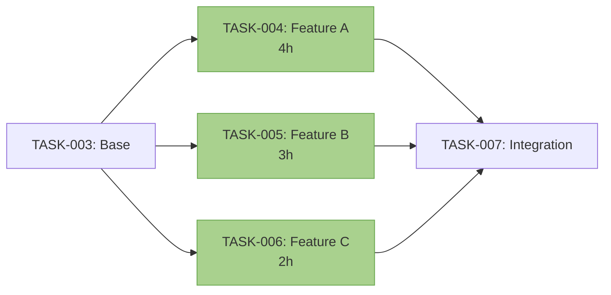
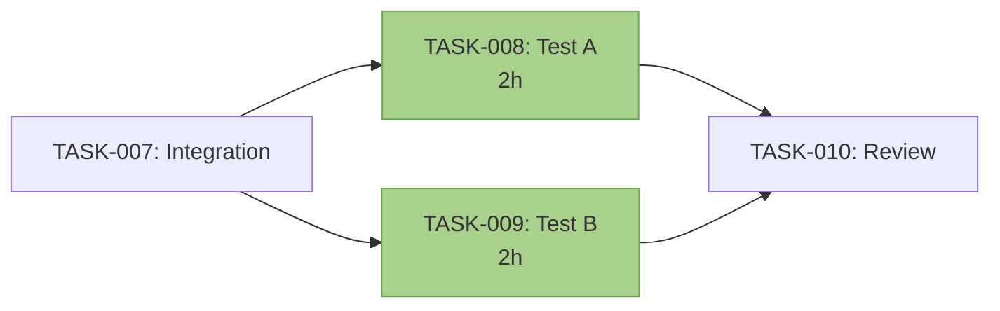

# Epic Dependencies: [Epic Name]

**Epic ID:** `XX-epic-name`
**Phase:** `v1.0.0-week-X-Y` or `v1.1.0-week-Z`
**Total Tasks:** XX tasks
**Critical Path Duration:** X days (Y% of epic)

---

## Visual Dependency Graph

### Complete Epic Task Flow

```mermaid
graph TD
    %% Critical Path (highlighted in red)
    START([Epic Start]):::start

    %% Foundation Tasks
    TASK001[TASK-001: Setup<br/>2h]:::critical
    TASK002[TASK-002: Config<br/>3h]:::normal
    TASK003[TASK-003: Base<br/>2h]:::critical

    %% Parallel Group 1
    TASK004[TASK-004: Feature A<br/>4h]:::normal
    TASK005[TASK-005: Feature B<br/>3h]:::normal
    TASK006[TASK-006: Feature C<br/>2h]:::normal

    %% Critical Integration
    TASK007[TASK-007: Integration<br/>4h]:::critical

    %% Parallel Group 2
    TASK008[TASK-008: Test A<br/>2h]:::normal
    TASK009[TASK-009: Test B<br/>2h]:::normal

    %% Final Tasks
    TASK010[TASK-010: Review<br/>3h]:::critical
    END([Epic Complete]):::end

    %% Dependencies
    START --> TASK001
    TASK001 --> TASK002
    TASK001 --> TASK003
    TASK003 --> TASK004
    TASK003 --> TASK005
    TASK003 --> TASK006
    TASK004 --> TASK007
    TASK005 --> TASK007
    TASK006 --> TASK007
    TASK007 --> TASK008
    TASK007 --> TASK009
    TASK008 --> TASK010
    TASK009 --> TASK010
    TASK010 --> END

    %% Styling
    classDef critical fill:#ff6b6b,stroke:#c92a2a,color:#fff,stroke-width:3px
    classDef normal fill:#4dabf7,stroke:#1971c2,color:#fff
    classDef start fill:#51cf66,stroke:#2f9e44,color:#fff
    classDef end fill:#ffd43b,stroke:#f59f00,color:#000
```

**Legend:**
- 🔴 **Red boxes** = Critical path (must complete on schedule)
- 🔵 **Blue boxes** = Normal tasks (some flexibility)
- 🟢 **Green** = Epic start
- 🟡 **Yellow** = Epic completion

---

## Critical Path Analysis

### Critical Path Tasks (Must Complete On Schedule)

**Total Critical Path:** X tasks, Y hours (Z days at 8 hours/day)

| Task ID | Title | Est. Hours | Blocks |
|---------|-------|------------|--------|
| TASK-001 | [Critical task 1] | 2h | TASK-003, TASK-007 |
| TASK-003 | [Critical task 2] | 2h | TASK-004, TASK-005, TASK-006 |
| TASK-007 | [Critical task 3] | 4h | TASK-008, TASK-009 |
| TASK-010 | [Critical task 4] | 3h | Epic completion |

**Why These Are Critical:**
- **TASK-001:** Foundation for entire epic - all tasks depend on this
- **TASK-003:** Core architecture decision - gates parallel work
- **TASK-007:** Integration point - combines parallel work streams
- **TASK-010:** Final validation - epic cannot complete without this

**Risk Mitigation:**
- Start critical path tasks first (no delay)
- Assign to most experienced agents
- Buffer 20% extra time for critical tasks
- Daily progress check on critical path

---

## Parallelizable Task Groups

### Parallel Group 1: Feature Implementation (After TASK-003)

**Can Work Simultaneously:**



**Parallel Work Strategy:**
- **TASK-004:** Assign to `backend-architect`
- **TASK-005:** Assign to `frontend-developer`
- **TASK-006:** Assign to `fullstack-developer`
- **Duration:** Max(4h, 3h, 2h) = 4 hours total (vs 9 hours sequential)
- **Speedup:** 2.25x faster with parallel execution

### Parallel Group 2: Testing (After TASK-007)

**Can Work Simultaneously:**



**Parallel Work Strategy:**
- **TASK-008:** Assign to `test-engineer` (backend tests)
- **TASK-009:** Assign to `frontend-developer` (frontend tests)
- **Duration:** Max(2h, 2h) = 2 hours total (vs 4 hours sequential)
- **Speedup:** 2x faster with parallel execution

### Total Parallelization Savings

**Sequential Execution:** X hours
**Parallel Execution:** Y hours
**Time Saved:** Z hours (W% reduction)

---

## Task Dependency Matrix

### Detailed Dependencies

| Task | Title | Required | Optional | Blocks | Parallelizable With |
|------|-------|----------|----------|--------|---------------------|
| TASK-001 | [Setup] | - | - | TASK-002, TASK-003 | - |
| TASK-002 | [Config] | TASK-001 | - | - | - |
| TASK-003 | [Base] | TASK-001 | TASK-002 | TASK-004, TASK-005, TASK-006 | - |
| TASK-004 | [Feature A] | TASK-003 | - | TASK-007 | TASK-005, TASK-006 |
| TASK-005 | [Feature B] | TASK-003 | - | TASK-007 | TASK-004, TASK-006 |
| TASK-006 | [Feature C] | TASK-003 | - | TASK-007 | TASK-004, TASK-005 |
| TASK-007 | [Integration] | TASK-004, TASK-005, TASK-006 | - | TASK-008, TASK-009 | - |
| TASK-008 | [Test A] | TASK-007 | - | TASK-010 | TASK-009 |
| TASK-009 | [Test B] | TASK-007 | - | TASK-010 | TASK-008 |
| TASK-010 | [Review] | TASK-008, TASK-009 | - | Epic complete | - |

**Dependency Types:**
- **Required:** Must complete before this task can start
- **Optional:** Helpful context but not blocking
- **Blocks:** Tasks that cannot start until this one completes
- **Parallelizable With:** Tasks that can run simultaneously

---

## External Dependencies

### Dependencies on Other Epics

**This Epic Requires:**
- [ ] Epic: `XX-previous-epic` (Status: ✅ Complete | 🔄 In Progress | 📋 Planned)
  - Why: Provides foundation for this epic
  - Specific Tasks: `TASK-XXX`, `TASK-YYY`
  - Blocker: Cannot start until complete

- [ ] Task: `TASK-ZZZ` from `YY-other-epic`
  - Why: Provides shared component/service
  - Impact: Blocks `TASK-004` in this epic

**This Epic Blocks:**
- Epic: `ZZ-dependent-epic` (Status: 📋 Waiting on this epic)
  - Why: Depends on features from this epic
  - Specific Tasks: Cannot start until this epic complete

### Infrastructure Dependencies

**Required Before Starting:**
- [ ] Database: SQLite/MySQL configured and migrated
- [ ] Environment: .env variables set (`APP_*`, `DB_*`)
- [ ] Dependencies: `composer install && npm install` complete
- [ ] Configuration: `php artisan config:cache` run

**Required During Epic:**
- [ ] Task `TASK-003`: Database migration must run
- [ ] Task `TASK-007`: Frontend build required (`npm run build`)
- [ ] Task `TASK-010`: E2E test environment ready

---

## Dependency Conflict Resolution

### Circular Dependencies (Should Not Exist)

**Check for Circular Dependencies:**
- [ ] All dependencies form a Directed Acyclic Graph (DAG)
- [ ] No task depends on itself (directly or indirectly)

**If Circular Dependency Found:**
1. Identify the cycle: TASK-A → TASK-B → TASK-C → TASK-A
2. Break the cycle by:
   - Splitting one task into two (before/after)
   - Removing the weakest dependency
   - Reordering implementation steps
3. Update task YAML front matter
4. Regenerate this dependency graph

### Conflicting Parallel Work

**Check for Resource Conflicts:**
- [ ] No two parallel tasks modify the same file
- [ ] No two parallel tasks require the same MCP server connection
- [ ] No two parallel tasks block on the same database migration

**If Conflict Found:**
- Serialize the conflicting tasks (remove from parallelizable group)
- Split shared file into two separate files
- Coordinate migration timing

---

## Dependency Update Protocol

### When to Update Dependencies

**Update this file when:**
- New task added to epic (regenerate graph)
- Task dependency changed (update matrix)
- Critical path changes (recalculate)
- Parallel groups change (update strategy)

### How to Update

1. **Update Task YAML Front Matter:**
   ```yaml
   dependencies:
     required: [TASK-XXX, TASK-YYY]
     optional: [TASK-ZZZ]
   blocks: [TASK-WWW]
   parallelizable_with: [TASK-VVV]
   ```

2. **Regenerate Mermaid Graph:**
   - Use automated script (if available)
   - Or manually update graph syntax

3. **Recalculate Critical Path:**
   - Use topological sort algorithm
   - Identify longest path from start to end

4. **Update Dependency Matrix:**
   - Add row for new task
   - Update blocked/parallelizable columns

5. **Commit Changes:**
   ```bash
   git add tasks/XX-epic-name/_DEPENDENCIES.md
   git commit -m "docs(tasks): update XX-epic dependencies"
   ```

---

## Task Execution Order Recommendation

### Optimal Execution Sequence

**Week 1:**
1. TASK-001 (2h) - Critical path start
2. TASK-002 (3h) - Sequential after TASK-001
3. TASK-003 (2h) - Critical path continue
4. **Parallel Group 1 Starts**
   - TASK-004 (4h) - Parallel agent 1
   - TASK-005 (3h) - Parallel agent 2
   - TASK-006 (2h) - Parallel agent 3

**Week 2:**
5. TASK-007 (4h) - Critical path integration
6. **Parallel Group 2 Starts**
   - TASK-008 (2h) - Parallel agent 1
   - TASK-009 (2h) - Parallel agent 2
7. TASK-010 (3h) - Critical path finish

**Total Duration:**
- Sequential: X hours (Y days)
- Parallel: Z hours (W days)
- Efficiency: W% time savings

---

## Troubleshooting Common Dependency Issues

### Issue 1: Blocked by Incomplete Dependency

**Symptom:** Task cannot start because dependency not marked complete

**Solution:**
```bash
# Check dependency status
grep "^id: TASK-XXX" tasks/**/*.md -A 1

# If dependency complete but not marked:
# Update TASK-XXX completion status
# Re-run dependency check
```

### Issue 2: Circular Dependency Detected

**Symptom:** Task A depends on Task B, but Task B depends on Task A

**Solution:**
- Review implementation plan
- Split one task into "before" and "after" subtasks
- Update YAML front matter to break cycle

### Issue 3: Parallel Work Conflict

**Symptom:** Two parallel tasks modify the same file, causing merge conflicts

**Solution:**
- Serialize the conflicting tasks (remove from parallel group)
- Or split file into two separate files
- Update parallelizable_with field

---

## Validation Checklist

Before marking this epic as dependency-reviewed:

- [ ] All tasks have complete dependency information in YAML front matter
- [ ] Mermaid graph accurately represents task relationships
- [ ] Critical path identified and highlighted
- [ ] Parallel groups defined and agents assigned
- [ ] No circular dependencies exist
- [ ] External dependencies documented
- [ ] Execution order recommendation provided
- [ ] Total epic duration calculated (sequential vs parallel)

---

**Template Version:** 1.0
**Last Updated:** 2025-11-09
**Related Design:** `docs/plans/2025-11-09-pinecms-task-system-design.md`
